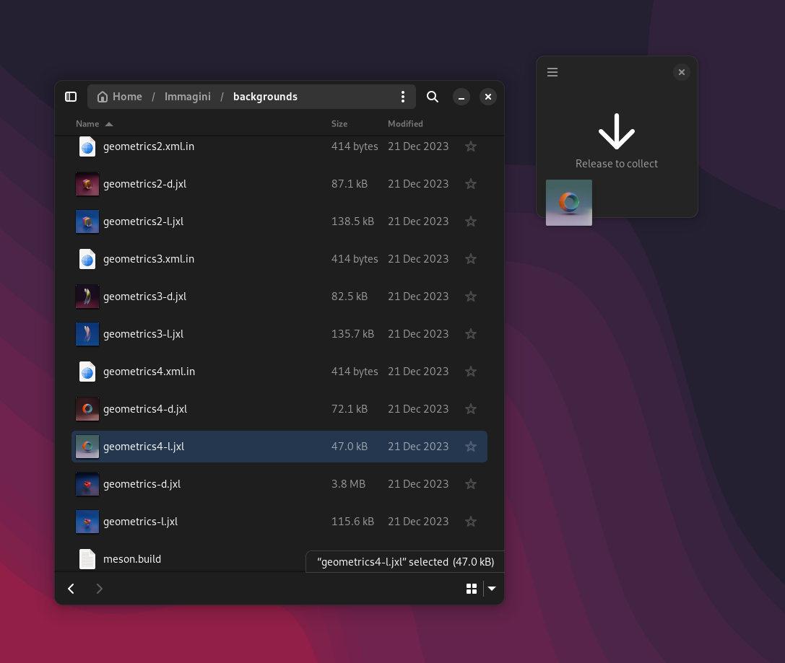

# Collector - Drag and Drop to the next level

Drag multiple files and folders on to Collection window, drop them anywhere!

- Browse and preview all you dropped items
- Open multiple Collector windows with a shortcut and customize their color
- Easily drag images from web browser windows and download them automatically
- Drag directly from Google Images!
- Drop the content of your clipboard with `Ctrl + V`
- Optionally group your text drops into a single, ready-to-use CSV file
- Modern design built with LibAdawaita

## Get the app

## Get the GNOME extension

___

